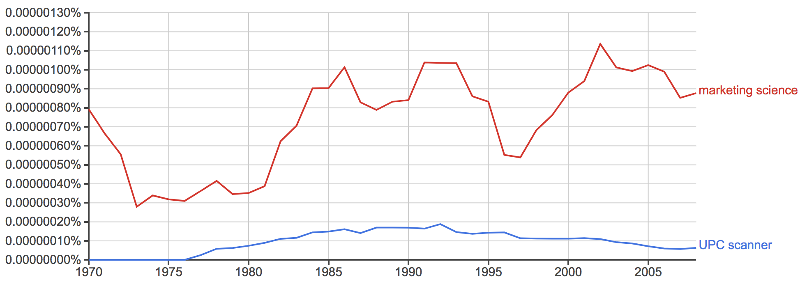

```{r setup, include=FALSE. cache=TRUE}
knitr::opts_chunk$set(echo = FALSE)
library(ggplot2) #for ggplot and plotting functions
library(mlogit) #for mlogit functions
library(data.table) # for data.table functions, aggregation etc.
library(gsubfn)

```

##Abstract

The introduction of panel scanner data led to new analytical methods in the retail industry, this report describes the business value the analysis can provide. This is supported by an example using a sample of Kantar panel scanner data for carbonated beverages, to illustrate possible outputs, business insights, and corresponding operational actions. Choice models are explored in detail, including teqchniques and considerations for calculating brand share elasticity and promotional effectiveness, additional modelling techniques and business use cases are then discussed, ending with the further value that could be added by including social data.

##Introduction

Panel scanner data is a category of retail data created by participating households repeatedly scanning products bought across a variety of stores over a period of time. Wideley refered to as UPC panel data, from the Universal Product Code that is scanned in the process, this kind of data became widely available to the field of marketing science throughout the 1980s (Guadagni & Little, 2008) and Figure 1, and has been used for a variety of business use cases (Bucklin & Gupta 1999). The introduction of UPC Data meant that households' purchasing decisions over time could be explored, rather than only aggregate store level sales data which had been predominant.



There are a wide variety of topics that are relevant to marketing managers (Neslin et al. 1994), many of which have been historically addressed by analysis of panel scanner data, e.g.:

* Calculation of own-price market share elasticity - the % change in market share given a % change in price.
* Promotional impact - % increase in market share given the existence of a promotion
* Grouping of Consumers *RESEARCH*
* Identification of price thresholds *RESEARCH*


##Data Description and Pre-processing

```{r loaddata}
fulldata <- read.csv("../Data/CarbonatesBottlesandCans (confidential).csv", fileEncoding = "latin1")
```

```{r exploratoryanalysis, eval=FALSE}
#households
tmp <- as.data.frame(table(fulldata$HOUSE))
plot(tmp$Freq)
boxplot(tmp$Freq)
mean(tmp$Freq)
median(tmp$Freq) 
nrow(tmp) #29214 households
nrow(tmp[tmp$Freq>=5,])/nrow(tmp) #81% of households have more than 5 observations
nrow(tmp[tmp$Freq>=50,])/nrow(tmp) #25% of households have more than 50 observations

#stores
tmp <- as.data.frame(table(fulldata$shop_desc))
tmp$Var1 <- factor(tmp$Var1, levels = tmp$Var1[order(tmp$Freq, decreasing = TRUE)])
ggplot(tmp, aes(x=Var1, y=Freq)) + geom_bar(stat="identity") + theme(axis.text.x = element_text(angle = 90, hjust = 1))
nrow(tmp[tmp$Freq>=500,])/nrow(tmp) #95% of stores have more than 500 observations

#categories
tmp <- as.data.frame(table(fulldata$cat_name))
tmp$Var1 <- factor(tmp$Var1, levels = tmp$Var1[order(tmp$Freq, decreasing = TRUE)])
ggplot(tmp, aes(x=Var1, y=Freq)) + geom_bar(stat="identity") + theme(axis.text.x = element_text(angle = 90, hjust = 1)) + ggtitle("all categories")

#subcategories
tmp <- as.data.frame(table(fulldata$sub_cat_name))
tmp$Var1 <- factor(tmp$Var1, levels = tmp$Var1[order(tmp$Freq, decreasing = TRUE)])
ggplot(tmp, aes(x=Var1, y=Freq)) + geom_bar(stat="identity") + theme(axis.text.x = element_text(angle = 90, hjust = 1)) + ggtitle("top subcategories")

#brands
tmp <- as.data.frame(table(fulldata$brand_name))
nrow(tmp) #170 brands
tmp <- tmp[tmp$Freq > 1.5*mean(tmp$Freq),]
tmp$Var1 <- factor(tmp$Var1, levels = tmp$Var1[order(tmp$Freq, decreasing = TRUE)])
ggplot(tmp, aes(x=Var1, y=Freq)) + geom_bar(stat="identity") + theme(axis.text.x = element_text(angle = 90, hjust = 1))

#range
tmp <- as.data.frame(table(fulldata$total_range_name))
nrow(tmp) #215 ranges
tmp <- tmp[tmp$Freq > 1.5*mean(tmp$Freq),]
tmp$Var1 <- factor(tmp$Var1, levels = tmp$Var1[order(tmp$Freq, decreasing = TRUE)])
ggplot(tmp, aes(x=Var1, y=Freq)) + geom_bar(stat="identity") + theme(axis.text.x = element_text(angle = 90, hjust = 1))

#epromdesc
tmp <- as.data.frame(table(fulldata$epromdesc))
nrow(tmp) #362 promotions
tmp <- tmp[tmp$Freq > 1.5*mean(tmp$Freq),]
tmp$Var1 <- factor(tmp$Var1, levels = tmp$Var1[order(tmp$Freq, decreasing = TRUE)])
ggplot(tmp, aes(x=Var1, y=Freq)) + geom_bar(stat="identity") + theme(axis.text.x = element_text(angle = 90, hjust = 1))
nrow(fulldata[!fulldata$epromdesc == "No Promotion",])/nrow(fulldata) #59% of observations have some promotion 

#looks like brand aggregates to store standard and value, whereas range has the actual stores (e.g. asda)
fulldata$date <- paste(fulldata$relweek,fulldata$DAY, sep="-")
length(unique(fulldata$date)) #364 days

##brand hierarchy (ensure bottom 3 include top 1)
fulldata$temp = paste(fulldata$total_range_name, fulldata$cat_name, fulldata$sub_cat_name)
brand <- aggregate(brand_name ~ temp, data=fulldata, FUN=function(x) length(unique(x)))
head(brand)

fulldata$volperpack = fulldata$Volume/fulldata$PACKS

```

```{r}
fulldata$date <- paste(fulldata$relweek,fulldata$DAY, sep="-")
fulldata$volperpack = fulldata$Volume/fulldata$PACKS

#take data only from the top retailer
data_ind_summary_pre <- fulldata[fulldata$shop_desc %in% c("1TESCO") &
                                fulldata$cat_name %in% c("Canned Colas","Canned Lemonade","Canned Other Flavours"),]


#prepare data to be aggregated
#by date, shop, household, range name, cat name and sub cat name
data_ind_summary_pre$product <- paste(data_ind_summary_pre$total_range_name, data_ind_summary_pre$sub_cat_name)
data_ind_summary_pre$key <- paste(data_ind_summary_pre$date, data_ind_summary_pre$shop_desc, data_ind_summary_pre$HOUSE, data_ind_summary_pre$product)
data_ind_summary_dt <- data.table(data_ind_summary_pre)
setkey(data_ind_summary_dt, key)

#aggregate and get:
#price per unit: count rows and sum net spend
#brand name tail, sub cat name tail, binary tail

df_ind_summary <- as.data.frame(data_ind_summary_dt[,
                        j=list(tail(date,1),
                               tail(HOUSE,1),
                               tail(shop_desc,1),
                               tail(product,1),
                               tail(sub_cat_name,1),
                               tail(cat_name,1),
                               tail(brand_name,1),
                               sum(Volume),
                               sum(NETSPEND,1)),
                        by=key])

colnames(df_ind_summary) <- c("key","date","HOUSE","shop_desc","product",
                             "sub_cat_name","cat_name", "brand_name", 
                             "Volume", "NETSPEND")
df_ind_summary$priceper330ml <- df_ind_summary$NETSPEND /  df_ind_summary$Volume *.33
```

```{r}
df_ind_summary$product[df_ind_summary$brand_name == "PL_Standard" & 
                         df_ind_summary$sub_cat_name == "Diet"] <- "Own Brand Diet"
df_ind_summary$product[df_ind_summary$brand_name == "PL_Standard" &
                         df_ind_summary$sub_cat_name == "Regular"] <- "Own Brand Regular"

tmp <- as.data.frame(table(df_ind_summary$product))
tmp$Var1 <- factor(tmp$Var1, levels = tmp$Var1[order(tmp$Freq, decreasing = TRUE)])
tmp <- tmp[order(tmp$Freq, decreasing = TRUE),]
tmpprods <- head(tmp$Var1,22)

df_ind_summary$product[!df_ind_summary$product %in% tmpprods] <- "Other"

```

The data is made up of around 29,000 UK households' purchases of canned and bottled carbonates and soft drinks over a year. The following analysis uses only data from the top retailer, as more reliable data is available on product availability for this store, as well as reducing computational run-time. The full data is made up of varying sized packages of beverages, including, for example, 330ml cans and 2 litre bottles. The analysis is made meaningful by focusing only on canned drinks, to focus on true competitors. Own brand products are treated as one product, and low volume brands are grouped together to narrow the data to 25 products. The price range for these products can be seen in the figure below, energy drinks such as Red Bull have a higher price than average, and interestingly, it does not seem like own brand products have a lower price than average, which may be due to the promotional pricing often used by major brands ^[Citation needed]:

```{r}
producttable <- as.data.frame(table(df_ind_summary$product))
producttable <- producttable[order(producttable$Freq, decreasing = TRUE),]
df_ind_summary$product <- factor(df_ind_summary$product, levels = rev(producttable$Var1))

ggplot(df_ind_summary, aes(x= product, y=priceper330ml, col=product)) + 
  geom_boxplot() + 
  theme_minimal() + 
  theme(legend.position = "none") + 
  xlab("Brand") + ylab("Price per 330ml")  + coord_flip()
```

The data had to be processed to identify which products were available in each store over the time period. Ideally this data would be available already, as the imputation is not necessarily fully comprehensive. After processing the dataset then constitutes a set of revealed preferences - the purchases that consumers actually made, this is opposed to stated preferences - the products that the consumers state are best. This structure of data allows a mixed multinomial logit model to be run, which became the default after the seminal work of Guadagni & Little (1983). This is an econometric tool that estimates the utility of each product (j) for each consumer (i) $$V_{i,j}$$ as a linear combination of explanatory variables, either belonging to the household (e.g.  income), or the properties of the product (e.g. price):

$V_{i,j} = \beta_1 + \beta_2 x_{i} +  \beta_3 x_{i,j} + \dots$

by modeling the  probability of making a particular choice as per the logit equation, where the probability of consumer i choosing product j is a function of the relative utility:

$Prob_{i,j} = \frac{e^{V_{i,j}}}{\Sigma_{(k \in K)} e^{V_{i,k}}}$

The key product level explanatory variables are price and promotion, which are supplemented by household level variables calculated from the data. The dataset did not already contain household-specific variables such as income or number of children, to be used as additional explanatory variables in the model, despite the fact they are often included as part of a UPC dataset. However, as there was a large enough time window, it was possible to calculate household-level variables from an initialisation period of the initialisation period (the first 60 days). In this case a loyalty variable was calculated: the proportion spent on each brand in the initialisation periof. An average spend variable was also calculated: the average vaule spent in the category per week over the first month. Finally, the total purchase incidence was calculated: the number of times the household made purchases in the first month. The data was then limited to households that made some purchases in the initialisation period, to avoid erroneous missing data for these initialisation variables. These variables account for some of the heterogeneity across households.

```{r}
initialisationperiod <- unique(df_ind_summary$date)[1:60]
df_ind_summary_init <- df_ind_summary[df_ind_summary$date %in% initialisationperiod,]

#get list of households in initialisation period
init_households <- unique(df_ind_summary_init$HOUSE)

#get total purchase incidences
totalpurchases <- data.frame(table(df_ind_summary_init$HOUSE))
colnames(totalpurchases) <- c("HOUSE","purchasefreq")

#get average purchase total
avgspend <- aggregate(NETSPEND ~ HOUSE, data = df_ind_summary_init, mean)
colnames(avgspend) <- c("HOUSE","avgspend")

#get proportion of spend per product
df_ind_summary_init_reshape <- dcast(data = df_ind_summary_init,
                                    formula = HOUSE~product,
                                    fun.aggregate = sum,value.var = "NETSPEND")

brandproportions <- cbind(id = df_ind_summary_init_reshape[, 1], df_ind_summary_init_reshape[, -1]/rowSums(df_ind_summary_init_reshape[, -1]))

colnames(brandproportions) <- paste("loyalty.",gsubfn(".",list(" " = "", "." = "", "(" = "", ")" = ""), colnames(brandproportions)), sep="")
colnames(brandproportions)[1] <- "HOUSE"
head(brandproportions)

##TODO: loyalty boxplots?
```

```{r, eval=FALSE}
df_ind_summary <- df_ind_summary[!df_ind_summary$date %in% initialisationperiod]
#Impute prices and availability from data
df_ind_summary$index = 1: nrow(df_ind_summary)
  
#Gets the prices for all products in that shop on that date
findfunction <- function(x, date, shop) {
  if (sum(df_ind_summary$product == x["Var1"] &
                     df_ind_summary$date == date &
                     df_ind_summary$shop == shop) > 0) {return(mean(df_ind_summary$priceper330ml[
                     df_ind_summary$product == x["Var1"] &
                     df_ind_summary$date == date &
                     df_ind_summary$shop == shop]))
                     } else {return(0)}
}

f <- function(x, output) {
    print(as.numeric(x["index"])/119742)
    print(x)
    return(apply(producttable,1, findfunction, x["date"], x["shop_desc"]))
 }

df_ind_summary_wide <- apply(df_ind_summary, 1, f)
rownames(df_ind_summary_wide) <- producttable$Var1
write.csv(df_ind_summary_wide,"df_ind_summary_wide.csv")
```

```{r loadwidedata, eval=FALSE}
df_ind_summary_wide <- read.csv("df_ind_summary_wide.csv")
df_ind_summary_wide_matrix = data.matrix(df_ind_summary_wide[2:dim(df_ind_summary_wide)[2]])
```

```{r processwidedata, eval=FALSE}
#Make price dataframe by transposing and adding "price." to column names
df_ind_summary_wide_t <- data.frame(t(df_ind_summary_wide_matrix))
names(df_ind_summary_wide_t) <- paste("price.", gsubfn(".",
                                             list(" " = "", "." = "", "(" = "", ")" = ""),
                                             as.character(df_ind_summary_wide[,1])), sep="")
#Make availability dataframe by checking if price = 0 and adding ".availability" to col names
availability <- data.frame(apply(df_ind_summary_wide_matrix, 1, function(x) {x != 0}))
names(availability) <- paste("availability.",gsubfn(".",
                                    list(" " = "", "." = "", "(" = "", ")" = ""),
                                    as.character(df_ind_summary_wide[,1])), sep="")
##concatenate required fields for mlogit
df_ind_summary_extended <- cbind(df_ind_summary[,c("date","shop_desc","product","HOUSE")],
                                 df_ind_summary_wide_t,availability)

df_ind_summary_extended$product <- gsubfn(".",
                                          list(" " = "", "." = "", "(" = "", ")" = ""),
                                          as.character(df_ind_summary_extended$product))
df_ind_summary_extended <- df_ind_summary_extended[!df_ind_summary_extended$date %in% initialisationperiod,]
df_ind_summary_extended <- df_ind_summary_extended[df_ind_summary_extended$HOUSE %in% init_households,]
df_ind_summary_extended <- merge(df_ind_summary_extended, totalpurchases)
df_ind_summary_extended <- merge(df_ind_summary_extended, avgspend)
df_ind_summary_extended <- merge(df_ind_summary_extended, brandproportions)
```

```{r eval=FALSE}
#takes 1 min to run
#create data frame with all data, including availability (in wide format)
temp_mlogit <- mlogit.data(df_ind_summary_extended,
                           shape = "wide",
                           varying = c(price=5:27,
                                       availability=28:50),
                           choice = "product", id.var = "HOUSE")
#subset only to the products that are available
temp_available <-  temp_mlogit[temp_mlogit$availability ,] 
temp_available <- temp_available[ , !(names(temp_available) %in% "availability")]

head(temp_available,50)

#and resend it through mlogit.data with format long 
csds.data <- mlogit.data(temp_available , choice = 'product', shape = "long" , alt.var = "alt" ,  chid.var = "chid")

save(csds.data, file="csdsdata.RData")
```

```{r eval=FALSE}
#takes 1h30 to run
Sys.time()
csds.ml <- mlogit(product ~ price, csds.data)
Sys.time()
summary(csds.ml)

save(csds.ml, file="csdsml2.RData")
```

```{R, eval = FALSE}
load("csdsml.RData")
load("csdsdata.RData")
```

```{r, eval= FALSE}
##Calculate Elasticity Matrix
elastdf <- setNames(data.frame(matrix(ncol = length(unique(csds.data$alt)), nrow = 0)), unique(csds.data$alt))
for (product1 in unique(csds.data$alt)){
  elast <- vector()
  for (product2 in unique(csds.data$alt)){
    #Calculate own share elasticity
    if (product1 == product2) {
      elast.temp = mean(csds.ml$coefficients["price"]*csds.ml$probabilities[,product1]*(1-csds.ml$probabilities[,product1])) /
        mean(csds.ml$probabilities[,product1])/(1/mean(csds.data$price[csds.data$alt==product1])) } else {
    #Calculate cross share elasticity
      elast.temp = -1*mean(csds.ml$coefficients["price"]*csds.ml$probabilities[,product1]*csds.ml$probabilities[,product2]) /
        mean(csds.ml$probabilities[,product1])/(1/mean(csds.data$price[csds.data$alt==product2])) }
    elast <- c(elast,elast.temp)}
  elastdf[product1,] <- elast}
elastdf
```

```{r}
##todo: clout v vulnerability plot
```

The coefficient on loyalty is positive, this aligns with the expectation that consumers are more likely to purchase a product that they previously showed loyalty to. This coefficient is important for manufacturers to understand about their category, if this coefficient is high, or is increasing over time, then this indicates that brand loyalty is particularly importance (or growing in importance), so more focus should be placed on improving brand image, or particularly on engaging consumers early in their lifecycle, e.g. by targeting mothers or children. Although sugary drink manufacturers may need to be wary of this approach.

Brand share elasticity and cross elasticity can then be calculated from the price coefficient, after calculating the marginal effects and dividing by the percentage price change (Calculation details can be found in Appendix 1). The consumer decision point that this is modeling is after the consumer has chosen what to buy (e.g. a canned drink), and how much to buy, which brand they then choose. Focussing on pepsi, we see that X has a highly cross-price elasticity, implying that this is a strong competitor. This information is useful for pricing strategies, in particular the distinction between Every Day Low Prices (EDLP) strategies compared to promotional strategies (Shankar & Krishnamurthi, 1996). At a more operational level, price elasticity information is also useful for manufacturing company account managers and retailer buyers, who work together regularly to define promotional prices.

Previously, retailers and manufacturers had access to aggregate level sales data, so they were able to calculate overall price elasticity and cross elasticity between brands. This analysis is still useful, however the additional insights that the panel scanner 

In terms of predicting consumer choice there are additional methods that are available e.g. a multinomial choice neutral network (CRAN,  2016), however these lack interpretability in terms of which factors are contributing to choice  ^[TO CHECK], which are really the key insights for business practicitioners. It is not much use to be able to predict an individual's choice, but rather to understand the mechanisms behind that choice. The neural network approach may be used, however, in simulations of consumer choice given a different competitive price structure, e.g. to see what the expected aggregate response would be given a change in price of one of the products.

#Switching Matrix
Bucklin et al. (1998) have shown how cross-price elasticities correspond, via a scaling factor, with brand-switching probabilities. 

##Extension to full choice model

The multinomial logit model fit above assumes that the consumer is making a purchase within the category, and is focusing on brand choice, and ignores other key business questions such as: what are the drivers for how often consumers come to the shop, and for how much they buy when they are there. As mentioned in Guadagni & Little (1983), this has little value to the retailer, who is interested in total spend at their store, and also has limitations for the manufacturers who are interested not only in brand share but in purchase incidence and quantity in the category.

**Include decision tree**

One of the commonly used modelling techniques to cater for this is the nested logit model (Guadagni & Little, 1998). This makes a broader assumption that the consumer is making a shopping trip, and then models whether the consumer will make a purchase within the category, and subsequently what their brand choice would be. The nested approach first estimates the traditional multinomial logit, and then uses the concept of "category attractiveness", to add the additional layer of product category choice on top of this. This handles the case where multiple products are purchased in one shopping trip, as it caters for multiple purchase opportunities within one shopping trip, in which the consumer may or may not purchase the same item. 


**Include decision tree**

This can then further be extended to purchase quantity, as has been done by (Gupta , 1998 , Chiang 1991, Chintagunta 1993 and Bucklin, Gupta & Siddarth 1998). For this, a zero-truncated Poisson model is often used (e.g. in Bucklin, Gupta & Siddarth 1998), to model count data where it is known that the count is greater than 0, which is the case in this situation as this model occurs after we know the consumer has made a purchase of the brand. The quantity elasticity that is produced by this model is total purchase elasticity, and this can be added to the brand choice elasticity from the multinomial logit model to get the overall elasticity. (reference xxxx).

**Include decision tree **

An additional layer could also be added to model the choice of retailer e.g. by Bucklin & Lattin (1992).

**Include decision tree **


#Modelling considerations

The multinomial logit is a model of choice within a category, assuming that the consumer has already decided to purchase within that category. For this reason the choice of "category" and which products to include within that category is incredibly important: "Should different flavors, or colors, or sizes be treated as different products or lumped together?" (Guadagni & Little 1983). 

Additional loyalty variables could also be calculated in addition to the product-loyalty calculated above, including umbrella brand loyalty, package-size loyalty (Guadagni & Little 1983) and flavour loyalty, to split out the specific consumer behaviour mechanisms that take place when making a product choice.

Much research has been done using UPC scanner data to produce models for consumer purchasing decisions, and has uncovered many additional subtleties and complexities that can be encorporated into the models. The models can be extended to include multiple "states" of consumer behaviour, e.g. planned purchases and spontaneous purchases. (Bucklin and Little, 1991).

There is evidence that suggests that the price elasticity may also change across the life-cycle of the product (Simon 1979, Parker 1992), Bijmolt, Heerde and Pieters (2005) found that price elasticities in general have been increasing over time, whereas share elasticities have remained quite constant. Elasticities may also be store dependent (Hoch et al 1995). How these mechanisms relate have key business implications, such as how to structure a pricing strategy over a product lifecycle (Bijmolt, Heerde and Pieters, 2005), and how to manage promotional pricing across retailers.

The functional form of the model may also be 

Walsh (1995) suggests an alternative model for products in which there are often multiple purchases, which is the case for carbonated soft drinks. This alternative model focusses on the "assortment" of goods that a consumer has in their inventory, and takes into account that the consumer purchase goods for unknown future occasions and may therefore value variety.

Bucklin & Gupta (1992) added another refinement to the model by including household response segements, grouping households by how they react to price and promotion variables, and then estimating their responses as a group. As mentioned by Guadagni & Little (1998), this caters for some of the heterogeneity amongst consumers, but by maintaining groups instead of going to the individual level, the reported segment variables are "managerially interpretable". Bucklin, Gupta & Siddarth (1998) continue this segmentation approach across the three tiers of purchase incidence, brand choice, and purchase quantity.

Each of these additional elements lead to a more refined model, catering for additional consumer considerations and behaviours, unfortunately in most cases they also lead to additional computational complexity, and if care is not taken, to results that are less easy to interpret by a retail professional. 

Fader & Hardie (1996) model choice not at the brand level, but at the SKU level, to introduce 


##Aggregate Level

Analysing panel scanner data at an aggregate level can help manufacturers to determine effectiveness of non-store campaigns (e.g. generalised online advertising and national television advertising)^[to cite].

##Limitations

Evidence has shown that marketing executives often make price promotion decisions intuitively rather than relying on the outputs of the empirical methods discussed above (Bogomolova, Szabo & Kennedy, 2017). Many of the theoretical and academic approaches are highly complex, have complex outcomes, and use highly esoteric language e.g. "" . These two facts are very likely linked. The outcomes of retail modelling approaches must be clear and actionable, and ideally the mechanisms to achieve those outcomes must be understandable (Neslin et al., 1994).

However, there is empirical evidence that analysing consumer data, including panel data, has a positive impact on company financial performance (Germann et al., 2014).

##Other Applications

Determining the impact of the "assortment effect", i.e. the impact on sales attributable to the number of SKUs within a category (Bucklin et al., 1998). Early uses of this data were to monitor, and assess effectiveness of product launches (Womer, 1944) and using this to predict future sales (Fourt & Woodlock 1960, Baum & Dennis 1961).

The multinomial logit model on panel scanner data has also been used to determine whether protected country of origin labels have a meaningful impact on consumer choice (Bonnet & Simioni 2001).

Econometric models can also be applied outside of the Consumer Packaged Goods industry,  

##References

Assmus, G., Farley, J. & Lehmann, D., 1984. How Advertising Affects Sales: Meta-Analysis of Econometric Results. Journal of Marketing Research, 21(1), pp.65–74.

Bijmolt, T.H., Heerde, H.J.V. and Pieters, R.G., 2005. New empirical generalizations on the determinants of price elasticity. Journal of marketing research, 42(2), pp.141-156.

Bogomolova, Szabo & Kennedy, 2017. Retailers' and manufacturers' price-promotion decisions: Intuitive or evidence-based? Journal of Business Research, 76, pp.189–200.

Bonnet, Céline, and Michel Simioni. "Assessing consumer response to Protected Designation of Origin labelling: a mixed multinomial logit approach." European Review of Agricultural Economics 28.4 (2001): 433-449.

Bucklin, R.E. and Gupta, S. 1999. Commercial Use of UPC Scanner Data: Industry and Academic Perspectives. Marketing Science, 18(3), pp.247–273.

Bucklin, R.E., Gupta, S. and Siddarth, S., 1998. Determining segmentation in sales response across consumer purchase behaviors. Journal of Marketing Research, pp.189-197.
Vancouver	

Bucklin, R.E. and Lattin, J.M., 1991. A two-state model of purchase incidence and brand choice. Marketing Science, 10(1), pp.24-39.

Bucklin, R.E. and Lattin, J.M., 1992. A model of product category competition among grocery retailers. Journal of Retailing, 68(3), p.271.
Vancouver	

Bucklin, R., Lehmann, D. & Little, J., 1998. From Decision Support to Decision Automation: A 2020 Vision. Marketing Letters, 9(3), pp.235–246.

Bucklin, R.E. et al., 1998. Modelling the effect of purchase quantity on consumer choice of product assortment. Journal of Forecasting, 17(3‐4), pp.281–301.

Cameron, A.C. & Trivedi, P.K., 1986. Econometric models based on count data. Comparisons and applications of some estimators and tests. Journal of Applied Econometrics, 1(1), pp.29–53.

Chintagunta, P.K., 1993. Investigating Purchase Incidence, Brand Choice and Purchase Quantity Decisions of Households. Marketing Science, 12(2), pp.184–208.

CRAN [https://cran.r-project.org/web/packages/nnet/nnet.pdf]

Dekimpe, M., & Hanssens, D., 1995. The Persistence of Marketing Effects on Sales. Marketing Science, 14(1), pp.1–21. TBI

Fader, Peter S., and Bruce GS Hardie. "Modeling consumer choice among SKUs." Journal of marketing Research (1996): 442-452.
APA	

Germann et al., 2014. Do Retailers Benefit from Deploying Customer Analytics? Journal of Retailing, 90(4), pp.587–593.

Google Ngrams, 2008. Representation of frequency of the terms "marketing science" and "UPC Scanner" in the Google ngram corpus from 1970 to 2008, digital image of data, Google Ngrams, accessed 10th August 2017, <https://books.google.com/ngrams/graph?content=UPC+scanner%2Cmarketing+science&year_start=1970&year_end=2008&corpus=15&smoothing=2&share=&direct_url=t1%3B%2CUPC%20scanner%3B%2Cc0%3B.t1%3B%2Cmarketing%20science%3B%2Cc0>.

Guadagni, P.M. and Little, J.D., 1983. A Logit Model of Brand Choice Calibrated on Scanner Data. Marketing Science, 2(3), pp.203–238.

Guadagni, P.M. and Little, J.D., 1998. When and what to buy: a nested logit model of coffee purchase. Journal of Forecasting, 17(3‐4), pp.303–326.

Guadagni, P.M. and Little, J.D., 2008. A Logit Model of Brand Choice Calibrated on Scanner Data: A 25th Anniversary Perspective. Marketing Science, 27(1), pp.26–28.

Gupta, S., 1988. Impact of Sales Promotions on When, What, and How Much to Buy. Journal of Marketing Research, 25(4), pp.342–355.

Hoch, S. et al., 1995. Determinants of Store-Level Price Elasticity. Journal of Marketing Research, 32(1), p.17.

Leeflang & Wittink, 1992. Diagnosing competitive reactions using (aggregated) scanner data. International Journal of Research in Marketing, 9(1), pp.39–57.

 (Guadagni and Little, 1987) - marketing impact

Leeflang & Wittink, 2000. Building models for marketing decisions:: Past, present and future. International Journal of Research in Marketing, 17(2), pp.105–126.

Neslin et al., 1994. A research agenda for making scanner data more useful to managers. Marketing Letters, 5(4), pp.395–411. TBI

Parker, P., 1992. Price Elasticity Dynamics Over the Adoption Life Cycle. Journal of Marketing Research, 29(3), p.358.

Russell, G. & Kamakura, W., 1994. Understanding Brand Competition Using Micro and Macro Scanner Data. Journal of Marketing Research, 31(2), pp.289–303. TBI

Seetharaman & Chintagunta, 1998. A model of inertia and variety-seeking with marketing variables. International Journal of Research in Marketing, 15(1), pp.1–17.  TBI

Simon, H., 1979. Dynamics of Price Elasticity and Brand Life Cycles: An Empirical Study. Journal of Marketing Research, 16(4), p.439.

Shankar V. & Krishnamurthi, L., 1996. Relating price sensitivity to retailer promotional variables and pricing policy: an empirical analysis. Journal of Retailing, 72(3), pp.249–272.

Wittink, D., 2000. The Estimation of Pre- and Postpromotion Dips with Store-Level Scanner Data. Journal of Marketing Research, 37(3), pp.383–395.

A Reference Price Model of Brand Choice for Frequently Purchased Products


https://cran.r-project.org/web/packages/mlogit/vignettes/mlogit.pdf
https://cran.r-project.org/web/packages/mlogit/vignettes/Exercises.pdf

http://environment.yale.edu/gillingham/GillinghamTsvetanov_SolarDemandCT.pdf logit trunc poiss

Anon, 2004. Multiple Discreteness and Product Differentiation: Demand for Carbonated Soft Drinks. Marketing Science, 23(1), pp.66–81.

http://www.jstor.org.iclibezp1.cc.ic.ac.uk/stable/pdf/184197.pdf?refreqid=excelsior:faed1bd872601514dca3256b0564c54e


